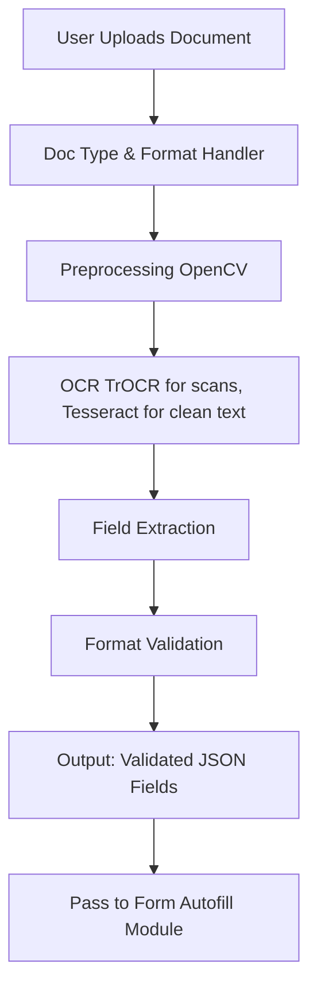
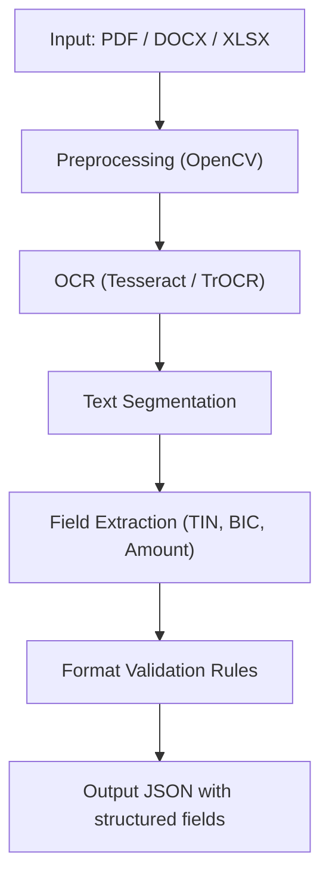
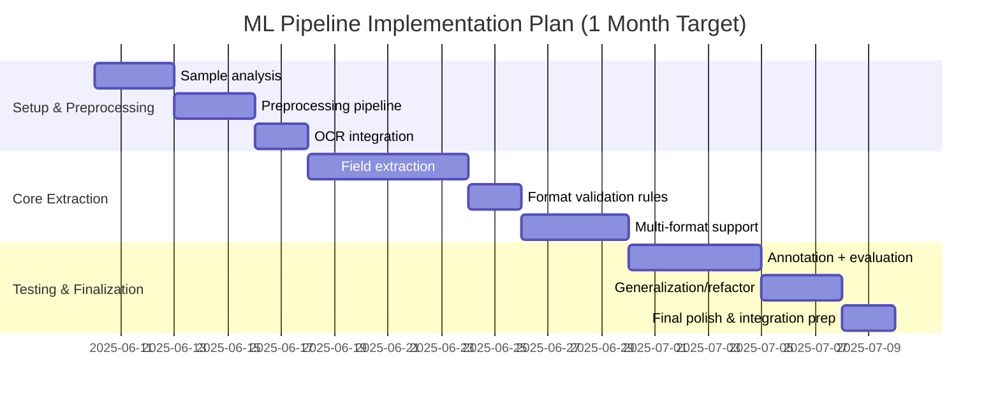

# ML Component Implementation Plan

## Objective

Implement a machine learning-based pipeline for extracting payment-related details from documents (PDF, DOCX, XLSX) using OCR and NLP.

## Scope

* Handle 3 document types or 1 type in 3 formats
* OCR preprocessing and text extraction
* Field extraction: TIN, BIC, amount, payment purpose
* Format validation
* Output structured JSON for downstream modules

## Architecture

* **Preprocessing**: OpenCV for deskewing, denoising
* **OCR**: Tesseract (CPU) or TrOCR (GPU) for layout-aware recognition
* **NLP**: Regex + spaCy or Transformers for field detection
* **Validation**: Basic checks on TIN, BIC, amount formats
* **Output**: JSON object with extracted values

## ML Pipeline Diagram

## Time Estimate

| Task                        | Duration |
| --------------------------- | -------- |
| Document structure analysis | 3 days   |
| Preprocessing pipeline      | 3 days   |
| OCR setup                   | 2 days   |
| Field extraction (NLP)      | 6 days   |
| Format validation           | 2 days   |
| Multi-format handling       | 4 days   |
| Testing & annotation        | 5 days   |
| Refactor & generalization   | 3 days   |
| Integration prep & buffer   | 2 days   |

**Total: 30 calendar days (\~22 working days)**
    
## Gantt Chart

## Deliverables

* OCR and preprocessing module
* Field extractor for 3 doc types or 3 formats
* Output schema (JSON)
* Evaluation report on extraction accuracy

## Cost Comparison for T4 GPU Deployment

| Provider                   | GPU Type       | Estimated Cost (USD/hr) | Notes |
|---------------------------|----------------|--------------------------|-------|
| **Google Cloud Platform** | T4 (on-demand) | $0.35 GPU + ~$0.38 VM = **~$0.73/hr** | VM + GPU billed separately |
| **Yandex Cloud**          | T4-equivalent  | **~$0.60–0.70/hr**       | Includes GPU + typical VM usage |
| **GPUDC.ru**              | 1xRTX 3090 24GB (T4 not available)   | ₽30–40/hr → **~$0.33–0.44/hr** | Physical workstation access |
